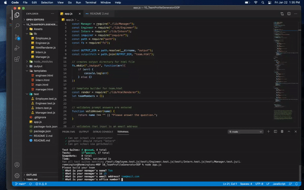
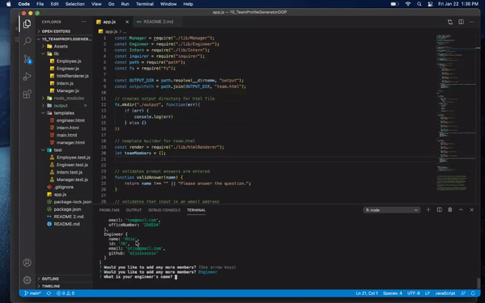
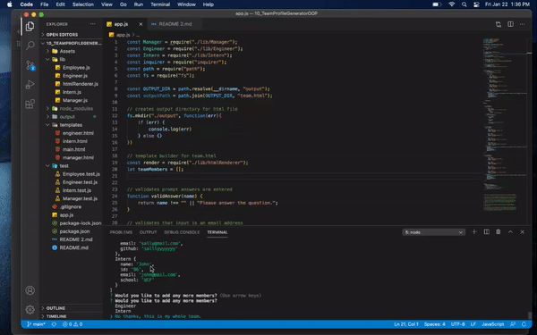

# Team Profile Generator


## Description
​
This project allows users to build a consolidated team profile using Node.js. 
​
## Table of Contents 
​
* [Installation](#installation)
​
* [Usage](#usage)
​
* [License](#license)
​
* [Contributing](#contributing)
​
* [Tests](#tests)
​
* [Questions](#questions)
​
## Installation
​
To install necessary dependencies, run the following command:
​
```
npm i
```

```
npm i jest
```
## Usage
​
use git clone to pull down the repo 
​
## License
​
This project is not licensed.
  
## Contributing
​
Users cannot contribute to this repo.
​
## Tests
​
To run tests, run the following command:
​
```
npm test
```
​
## Screenshots








### Screen Recorder Link
<https://drive.google.com/file/d/1FIDfAOxkTT9Huejiph1gfEptQX7s161t/view?usp=sharing>

## Questions
​
If you have any questions, please contact me directly at <s.pascone@knights.ucf.edu>.
More of my work can be found at [rmmngtn](https://github.com/rmmngtn/).

